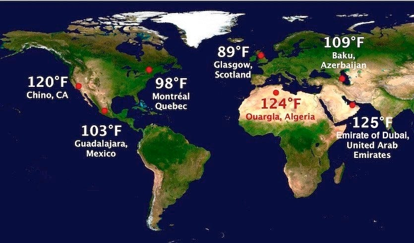

# World Weather Analysis
## Background
A travel company would like to add a feature on its website that lists, on a map, ideal hotels around the world based on clients’ weather preferences entered on the search page.

## Project Overview
To achieve the above goal, API call to the OpenWeatherMap API will be made to collect weather data from cities accross the world. Then this data will be layered ont Google Maps and Places to plot hotels that match the users' weather preferences.

## Resources
- Python
- Citipy
- Jupyter Notebook

## Data Source
- OpenWeatherMap API
- Google Maps and Places API
